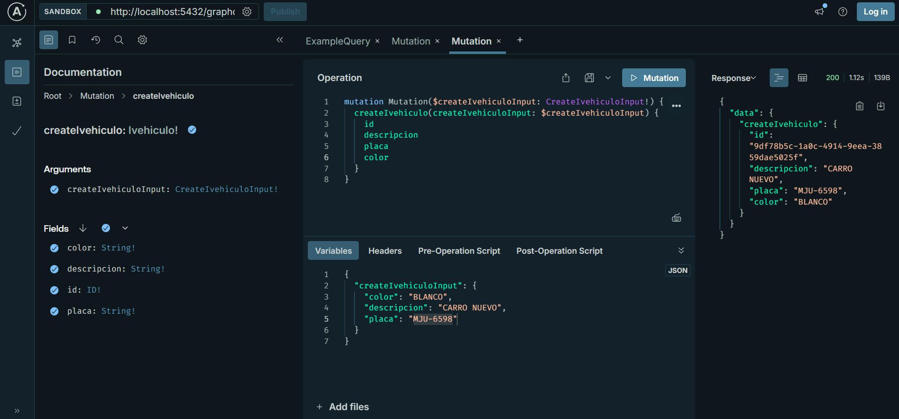
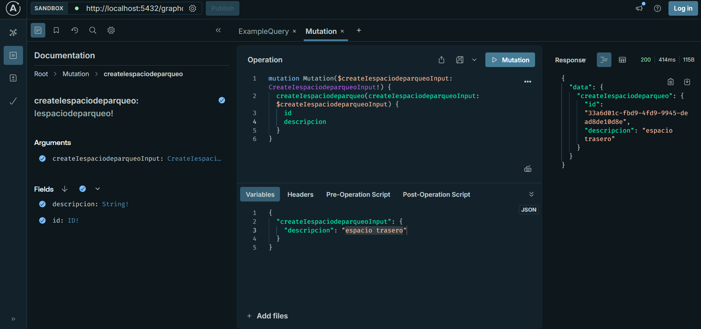
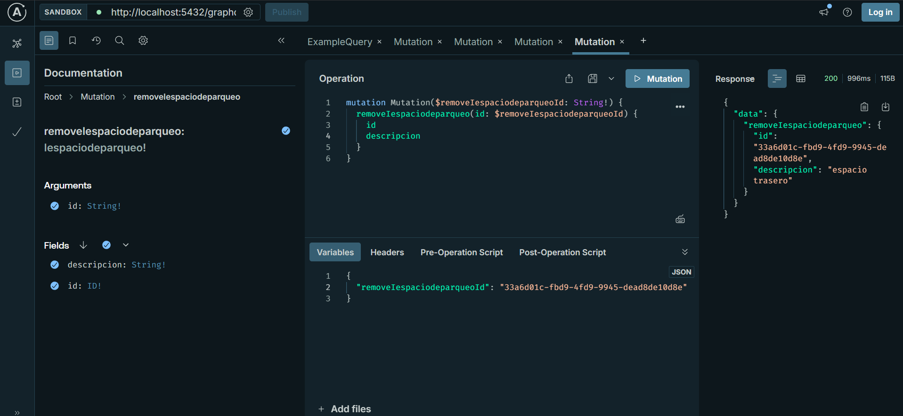

Se necesita instalar nest.js mediante el comando nest new
Se necesita instalar config, validations y graphQL
Para levantar el proyecto se debe ejecutar la linea de comando npm run start:dev
Luego debe dirigirse a la direccion http://localhost:5432/graphql

Imagenes de evidencia:

