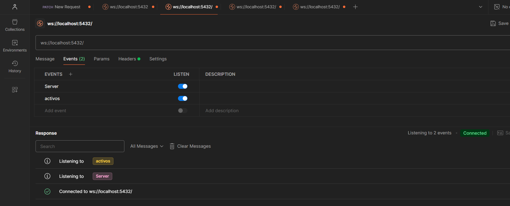
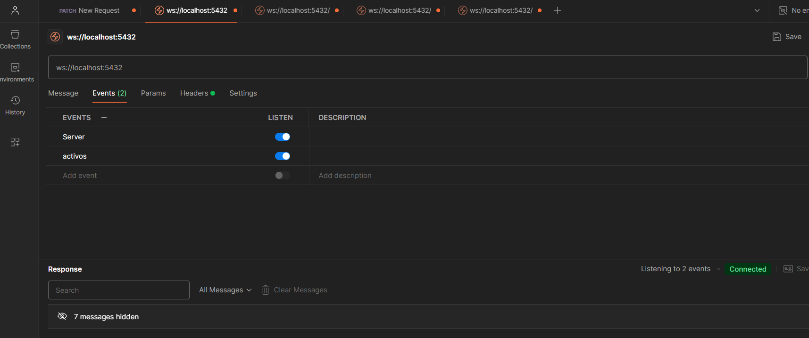
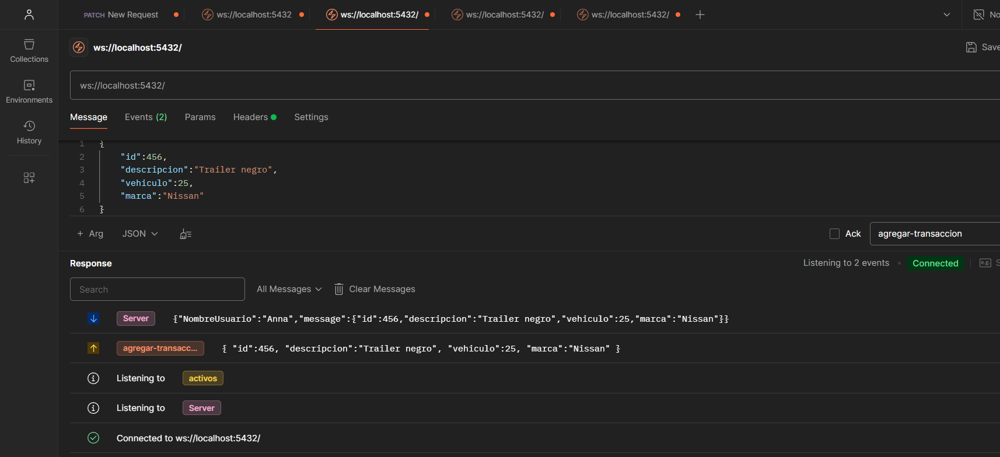
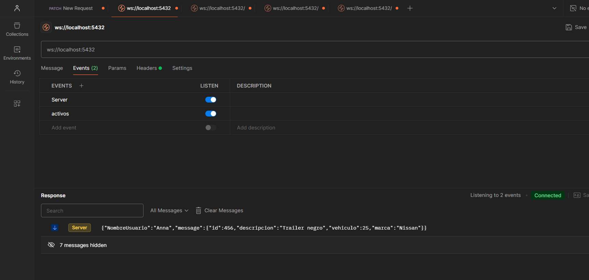

Se necesita instalar nest.js 
Se necesita instalar las dependencias de Websocket
Ejecutar la linea de comando npm run start:dev
Dirigirse a la direccion ws://localhost:5432/

Imagenes de evidencia:

